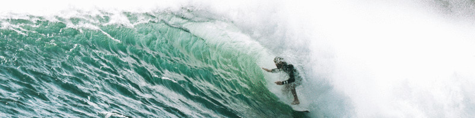
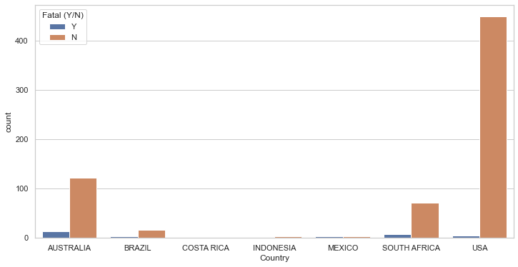
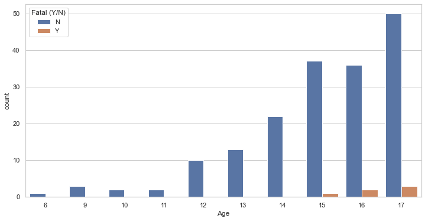
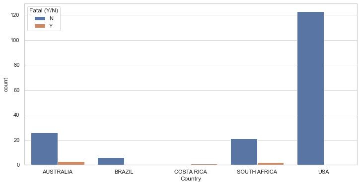
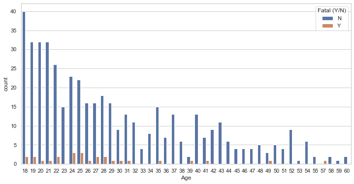
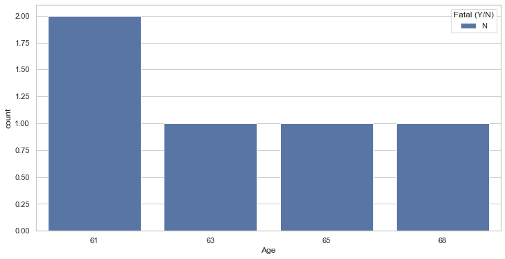
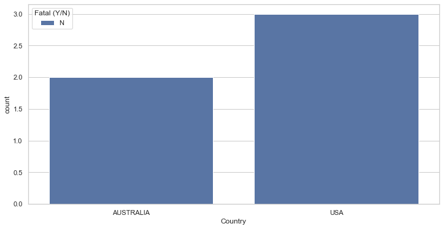

# Surfing's Shark Encounters

## Introduction

The goal of the Sharks Project is to perform an analysis of the "Global Shark Attacks" database, which was extracted from Kaggle. This database contains data on shark attacks of all kinds from 1845 to 2018.

The purpose of this project is to explore the database and analyze the useful data it contains. Various data processing, filtering, and visualization tools have been employed to achieve this objective.

## Data Processing

To begin the analysis, the dataset was processed to remove any missing or empty values. Once the dataset was cleaned, the focus was narrowed down to examine the mortality rate resulting from shark attacks during aquatic activities involving surfing.

To conduct a comprehensive analysis of this situation, the dataset was filtered to identify the best countries for engaging in aquatic activities associated with surfing. The selected countries for analysis are Australia, Brazil, Costa Rica, Indonesia, Mexico, South Africa, and the USA.

Next, regular expressions (regex) were used to search for occurrences of "Surfing" within the dataset. The dataset was then divided into three subgroups based on age ranges: 0-17, 18-60, and 61 and above. This division allowed for an examination of the mortality rates of shark attacks within each age range.

## Data Visualization

The visualizations above illustrate the distribution of shark attack mortality rates across different age groups engaged in surfing activities in various countries. These visualizations offer valuable insights into the severity of shark attacks within each age range.

Here we can observe the fatality rates among young individuals across various countries.

Here we can observe the fatality rates among adults individuals across various countries.

Here we can observe the fatality rates among senior individuals across various countries.

## Conclusion

Based on the data analysis conducted, it has been determined that Australia and the USA are the most suitable countries for engaging in surfing-related aquatic activities. This conclusion takes into account the frequency of shark attacks and the corresponding mortality rates in each of these countries.

By following the steps outlined in this project, researchers and enthusiasts can gain a better understanding of shark attacks during surfing activities and make informed decisions regarding water safety in different regions.